# Image Editing with Diffusion Models


# !!STILL WORK IN PROGRESS!!

## Authors
*   [**Luca Conti**](https://github.com/iamlucaconti/) (ID: 1702084)
*   [**Daniele Sabatini**](https://github.com/danilsab24/) (ID: 1890300)


## Project aim and selected paper
This project is based on the implementation of the paper [**InstructPix2Pix: Learning to Follow Image Editing Instructions**](https://arxiv.org/abs/2211.09800).  

Our implementation is divided into three main parts:

1. **Fine-tuning LLM**  
   In the first part, we fine-tuned a LLM model to create a dataset containing original prompts, edit prompt and edited prompts that would later be used for the second component of the project.

2. **Image Generation with Stable Diffusion and ControlNet**  
   In the second part, we used the prompts generated in the first part to create pairs of images, where one was the edited version of the other (i.e., maintaining coherence between them).  
   For this, we employed **Stable Diffusion** together with **ControlNet**.  
   The generated images were then used to build the dataset required for the final part of the project.

3. **Fine-tuning InstructPix2Pix**  
   In the last part of the project, we used the dataset produced in the second part to fine-tune a Stable Diffusion model.  

Given an input image and an accompanying edit instruction, our model generates the corresponding modification directly. Unlike approaches that rely on detailed textual descriptions of both the source and target images, our method requires only the instruction (`edit_prompt`) and performs the edit in a single forward pass, without per-example inversion or additional fine-tuning. An example generated by our model is shown below:  

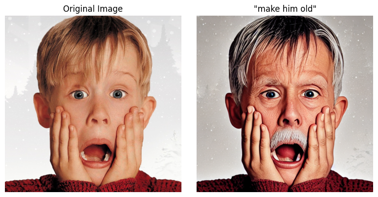  


## 1. Generating Instructions and Paired Captions


>To finetune a LLM to generate a dataset of paired captions, run the notebook **`generate_txt_dataset.ipynb`** and edit the variables in the corresponding section.

The notebook **`generate_txt_dataset.ipynb`** implements the first stage of the project.  
It contains the code for fine-tuning the [**Gemma 2B**](https://huggingface.co/google/gemma-2b) model to generate an **`edit_prompt`** and an **`edited_prompt`** given an **`original_prompt`**.

For fine-tuning, we built a dataset of **800 samples**:

- **400 manually created samples**:  Starting from the `original_prompt` in the `TEXT` column of the [**laion/aesthetics_v2_4.75**](https://huggingface.co/datasets/laion/aesthetics_v2_4.75) dataset, we manually designed both the `edit_prompt` and the `edited_prompt`.  

- **400 samples from existing data**:  
  Taken directly from the [**InstructPix2Pix training dataset**](https://huggingface.co/datasets/timbrooks/instructpix2pix-clip-filtered), as used in the original paper.


The dataset used for fine-tuning Gemma 2B is available at:
 ```
 ./datasets/txt_dataset_finetuning.jsonl
 ```

Using the fine-tuned LLM, we then prepared the paired caption dataset for the second stage of the project:

- **2,900 samples** from [**visual-layer/imagenet-1k-vl-enriched**](https://huggingface.co/datasets/visual-layer/imagenet-1k-vl-enriched).  
  For each sample, the `original_prompt` was passed to the fine-tuned model, which generated the corresponding `edit_prompt` and `edited_prompt`.  

- **150 manually created samples**:  
  Added to further enrich the dataset.


We provide our generated dataset of captions and edit instructions in:
 ```
 ./datasets/generated_txt_dataset.jsonl
 ```

## 2. Generating Paired Images from Paired Captions

>To generate a dataset of paired images from paired captions, run the notebook **`generate_img_dataset.ipynb`** and edit the variables in the corresponding section.

To generate the original images, we used the Stable Diffusion model `runwayml/stable-diffusion-v1-5`.  
Image editing is guided by `lllyasviel/sd-controlnet-canny`, which uses the source image structure (Canny edges) along with the target prompt to produce controlled edits.  
>**Note**  
[Prompt-to-Prompt](https://arxiv.org/abs/2208.01626) replaces *cross-attention* weights in the second generated image differently depending on the type of edit (e.g., word swap, adding a phrase, increasing or decreasing the weight of a word).  
[Brooks et al.](https://arxiv.org/abs/2211.09800), on the other hand, replaced *self-attention* weights of the second image during the first $p$ fraction of diffusion steps and applied the same attention weight replacement strategy for all edits.  
However, replacing self-attention weights is computationally expensive. Moreover, finding the optimal combination of parameters for the original Prompt-to-Prompt method requires extensive search for each image. For these reasons, we opted to use [ControlNet](https://arxiv.org/abs/2302.05543) (Canny) instead. The only parameter we performed a search over was `controlnet_conditioning_scale`.

All images are generated at a resolution of `HEIGHT = 512 x WIDTH = 512` using `STEPS = 40` diffusion steps. A fixed seed (`SEED1=20230330`) ensures reproducibility.  
To evaluate the generated images and enable filtering, we used the CLIP model `openai/clip-vit-large-patch14` to measure semantic and visual similarity between images and text.  
The figure below shows the result of generating an image with the **`original_prompt`** (left) and the **`edited_prompt`** (right), without using ControlNet guidance.

  

The two images are not consistent (e.g., the bear is in a different position and the overall composition changes).  
The figure below shows the result of generating an image with the **`original_prompt`** (left) and the **`edited_prompt`** (right), using ControlNet guidance, where the structure of the source image is preserved: 


The `controlnet_best` function generates a source image with Stable Diffusion and then creates a target image using ControlNet guided by Canny edges. Key steps include:

1. Generate the source image (`image_sd`) from `src_prompt`.
2. Preprocess the image for ControlNet:

   * Convert to Canny edges.
   * Resize to target resolution.
3. Iterate over multiple `controlnet_conditioning_scale` values to generate candidate edited images.
4. Evaluate candidate images using:

   * CLIP directional similarity (`dir_sim`)
   * Image-to-image similarity (`img_img_sim`)
   * Image-to-caption similarity (`img_cap_sim`)
5. Filter images based on thresholds (`dir_sim >= 0.15`, `img_img_sim >= 0.65`, `img_cap_sim >= 0.2`).
6. Return the image with the highest directional similarity.

>**Note**  
Our generated dataset of 1001 samples is available on Hugging Face ([here](https://huggingface.co/datasets/iamlucaconti/instructpix2pix-controlnet)).


## 3. Training InstructPix2Pix

In the notebook **`train_instruct_pix2pix.ipynb`** we fine-tuned only the **denoising U-Net** inside Stable Diffusion v1.5 so that the model can learn to follow edit instructions (e.g., "make it look like winter") while being conditioned on:

* the `original_image` (providing structural reference), and

* the `edit_prompt` (guiding the transformation).

This process teaches the model how to follow textual editing instructions in the style of InstructPix2Pix, without modifying the pretrained text encoder or VAE.  

>**Note**  
For the fine-tuning procedure, we followed the [official Hugging Face guide](https://github.com/huggingface/diffusers/tree/main/examples/instruct_pix2pix).


Training a model like InstructPix2Pix can be demanding on your hardware. However, by enabling `gradient_checkpointing` and `mixed_precision`, it's possible to train on a **single 24GB GPU**.
For faster training or larger batch sizes, we **strongly recommend** using GPUs with **at least 30GB of memory**.


> **Note**  
The notebook `train_instruct_pix2pix.ipynb` contains the training setup.  
The provided settings have been successfully tested on a **40GB NVIDIA A100 GPU**.  
We trained using [our generated dataset](https://huggingface.co/datasets/iamlucaconti/instructpix2pix-controlnet).   
You can find the resulting model on Hugging Face ([here](https://huggingface.co/iamlucaconti/instruct-pix2pix-model)).


---
The main steps of the finetuning are the following:

### Latent Encoding
The edited target image is encoded into the latent space using the VAE encoder and scaled to Stable Diffusion’s representation. 

```python
latents = vae.encode(batch["edited_pixel_values"].to(weight_dtype)).latent_dist.sample()
latents = latents * vae.config.scaling_factor
```
In Stable Diffusion v1.5 `vae.config.scaling_factor` is equal to 0.18215.


### Forward Diffusion (Noise Injection)
Gaussian noise is sampled and added to the latents according to a randomly chosen timestep. This simulates the forward diffusion process the U-Net must learn to invert.

```python
noise = torch.randn_like(latents)
bsz = latents.shape[0]
timesteps = torch.randint(0, noise_scheduler.config.num_train_timesteps, (bsz,), device=latents.device).long()

noisy_latents = noise_scheduler.add_noise(latents, noise, timesteps)
```

Mathematically, `noisy_latents` $x_t$ are computed as:
$x_t = \sqrt{\alpha_t}x_0 +  \sqrt{1-\alpha_t} \epsilon$

where:

* $x_0$ = the `edited_image`
* $\epsilon$ = Gaussian noise ($\epsilon$)
* $x_t$ = latents at timestep $t$ (noisy)
* $\alpha_t$ = decay factor determined by the scheduler

In simple terms, the process **mixes the image with an amount of noise controlled by the timestep**.


### Conditioning Signals
**Textual Conditioning:** The input instruction (`edit_prompt`) is encoded using the text encoder.  
**Image Conditioning:** The `original_image` is also encoded into latent space, providing a structural reference.

```python
# Textual conditioning
encoder_hidden_states = text_encoder(batch["input_ids"])[0]

# Image conditioning (mode instead of Gaussian sample)
original_image_embeds = vae.encode(batch["original_pixel_values"].to(weight_dtype)).latent_dist.mode()
```

### Conditioning Dropout (Classifier-Free Guidance)


During training, [Brooks et al.](https://arxiv.org/abs/2211.09800) randomly set only image condition
$c_I =\emptyset_I$ for 5% of examples, only text conditioning $c_T =\emptyset_T$ for 5% of examples,
and both $c_I =\emptyset_I$ and $c_T =\emptyset_T$ for 5% of examples.
So, we did the same:

* Sometimes the text or image conditioning is randomly dropped (replaced with null embeddings).

* This allows the model to learn to handle both conditional and unconditional cases, which is essential for classifier-free guidance during inference.

```python
if args.conditioning_dropout_prob is not None:
    random_p = torch.rand(bsz, device=latents.device, generator=generator)

    # Drop text conditioning
    prompt_mask = (random_p < 2 * args.conditioning_dropout_prob).reshape(bsz, 1, 1)
    null_conditioning = text_encoder(tokenize_captions([""]).to(accelerator.device))[0]
    encoder_hidden_states = torch.where(prompt_mask, null_conditioning, encoder_hidden_states)

    # Drop image conditioning
    image_mask_dtype = original_image_embeds.dtype
    image_mask = 1 - (
        (random_p >= args.conditioning_dropout_prob).to(image_mask_dtype)
        * (random_p < 3 * args.conditioning_dropout_prob).to(image_mask_dtype)
    )
    image_mask = image_mask.reshape(bsz, 1, 1, 1)
    original_image_embeds = image_mask * original_image_embeds
```


### Concatenation
The noisy latents are concatenated with the original image embeddings: this provides the U-Net with both the noisy edited image and the reference image.

```python
concatenated_noisy_latents = torch.cat([noisy_latents, original_image_embeds], dim=1)
```

### Prediction Target and loss Computation

The U-Net predicts the added noise and then the prediction is compared with the true target (namaly the added noise $\epsilon$) using mean squared error (MSE). 

```python
model_pred = unet(concatenated_noisy_latents, timesteps, encoder_hidden_states, return_dict=False)[0]
loss = F.mse_loss(model_pred.float(), target.float(), reduction="mean")
```

### Optimization
* Loss is backpropagated with gradient accumulation.
* Gradients are optionally clipped for stability.
* Optimizer and scheduler step forward.
* Only the U-Net weights are updated — the VAE and text encoder remain frozen.
* Exponential Moving Average (EMA) weights of the U-Net can also be updated for smoother convergence.


## How to use our model

To edit an image using our model:

```python
import os
import torch
import requests
import matplotlib.pyplot as plt
from PIL import Image, ImageOps
from io import BytesIO
from diffusers import StableDiffusionInstructPix2PixPipeline

def download_image(url: str, resize: bool = False, resolution: int = 512) -> Image.Image:
    # Download and open the image
    image = Image.open(BytesIO(requests.get(url, stream=True).content))
    image = ImageOps.exif_transpose(image).convert("RGB")

    if resize:
        w, h = image.size
        if w > h:
            new_w = resolution
            new_h = int(h * resolution / w)
        else:
            new_h = resolution
            new_w = int(w * resolution / h)
        image = image.resize((new_w, new_h))

    return image

# Parameters
pretrained_model_name_or_path = "iamlucaconti/instruct-pix2pix-model"  # Custom Pix2Pix model
image_url = "<URL OF IMAGE TO EDIT>"
prompt = "<YOUR EDIT PROMPT>"  # Instructional edit prompt
num_inference_steps = 50        # More steps = higher quality but slower
image_guidance_scale = 2.0      # Strength of adherence to input image
guidance_scale = 3.0            # Strength of adherence to text prompt
seed = 0                        # Random seed (for reproducibility)
output_path = "output.png"      # File to save result

# Load pipeline
pipe = StableDiffusionInstructPix2PixPipeline.from_pretrained(
    pretrained_model_name_or_path,
    torch_dtype=torch.float16,
    safety_checker=None
).to("cuda")

# Load image
image = download_image(image_url, resize=True)

# Set seed
generator = torch.Generator("cuda").manual_seed(seed)

# Generate the edited image
edited_image = pipe(
    prompt=prompt,
    image=image,
    num_inference_steps=num_inference_steps,
    image_guidance_scale=image_guidance_scale,
    guidance_scale=guidance_scale,
    generator=generator
).images[0]

# Save 
edited_image.save(output_path)
```

Make sure you have the required dependencies installed and that your environment (e.g., Python, PyTorch, Hugging Face libraries) is properly set up.


>If you’d like to experiment with different contextual edits, varying latent noise seeds, or even sequential editing workflows, check out the ready-to-use notebook `editing_img.ipynb` we provide.


## Results
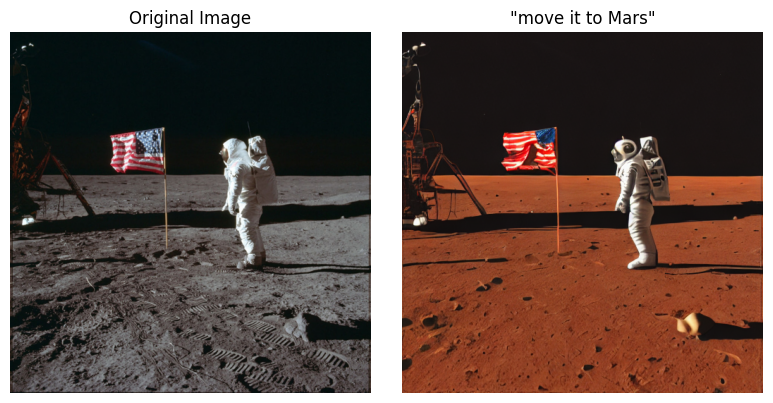  
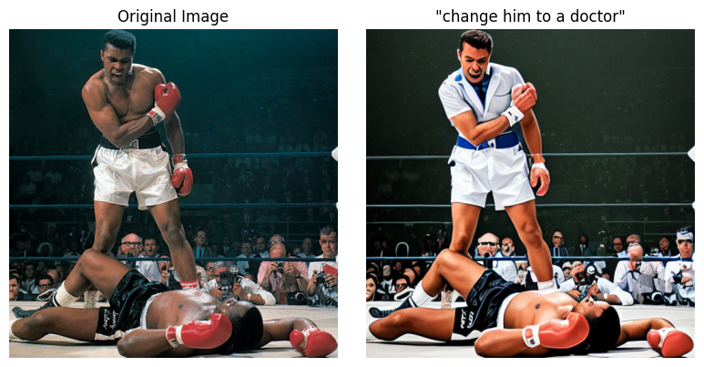  
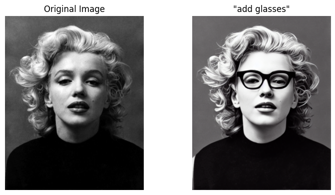 
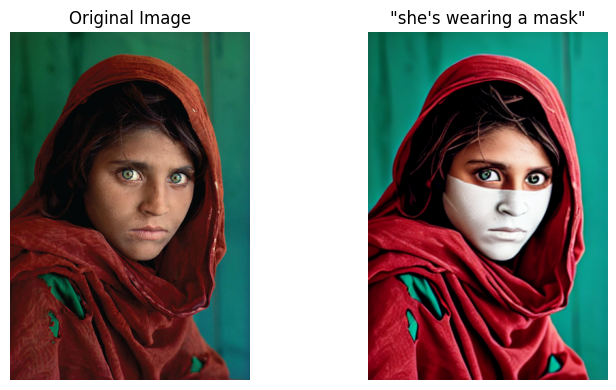  

### Images shown with different contextual edits
The following examples show how the same base images can be altered with different contextual instructions:
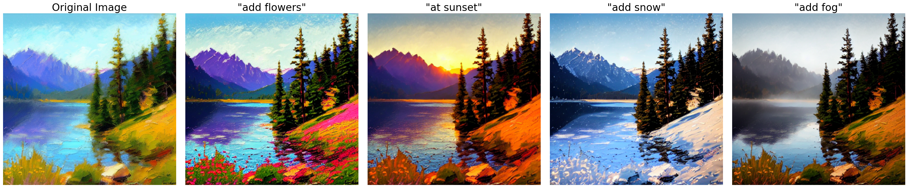  
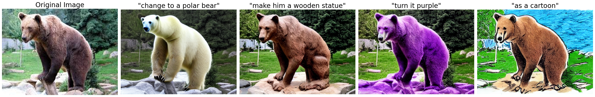  
## Different latent noise 
By varying the latent noise, our model generates multiple plausible edits for the same input image and instruction:
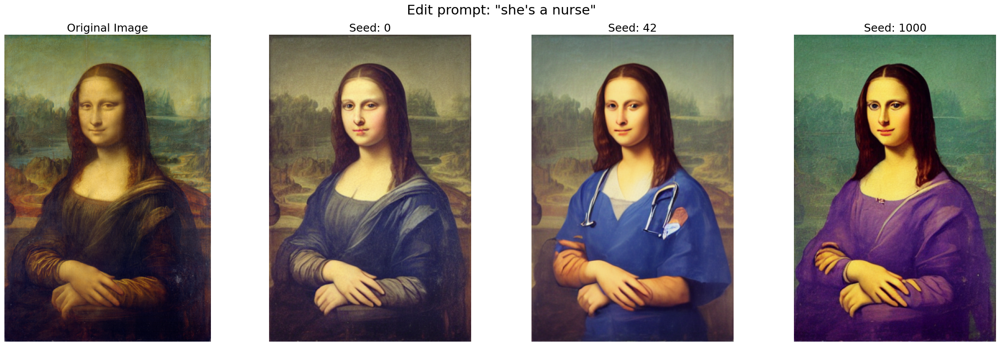  
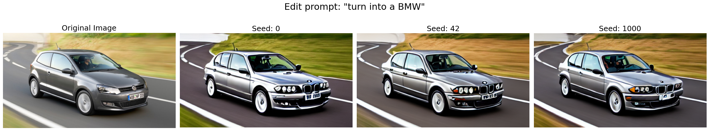  


### Sequential (Concatenated) Edits
Applying our model recurrently with different instructions produces compounded transformations:
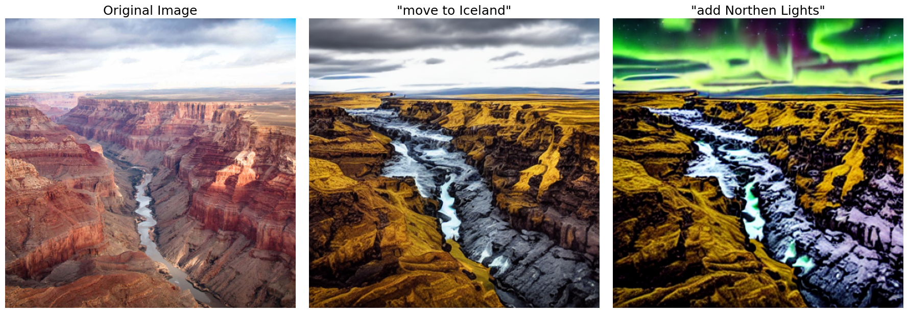  

> Repeatedly applying edits can lead to artifacts, loss of detail, or visual drift away from the original image.

### Classifier-free guidance weights over two conditional inputs
Two guidance scales, `guidance_scale` ($s_T$) and `image_guidance_scale` ($s_I$),
can be adjusted to trade off how strongly the generated samples correspond with the input image and how strongly they correspond with the edit instruction:

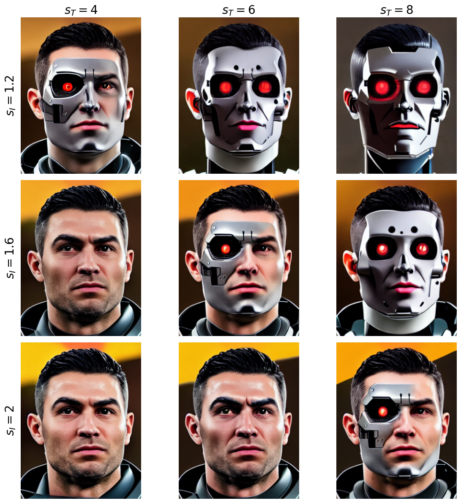  


## Limitations and reflections

### Generated Instructions and Paired Captions
* **Hardware constraints**:  Since the experiments were conducted on **Google Colab Pro**, which provides only **40 GB of A100 GPU memory**, it was not possible to fine-tune larger models such as **GEMMA 7B** or **GPT-3**(like in the original paper).  
This restriction limited the scalability of our experiments and made the final dataset less precise compared to the one presented in the original paper.

* **Dataset constraints**: The dataset used for fine-tuning was **partially created manually**, which resulted in a relatively **small dataset size**.  
This limitation affects the quality of the fine-tuning process, reducing the model’s ability to generalize effectively.

### Generated Paired Images from Paired Captions

* **Dependence on Pretrained Models:** The quality and diversity of the generated dataset are bounded by the pretrained model’s biases, i.e., if SD struggles with certain subjects or styles, the dataset will inherit those limitations.

* **Synthetic Data Bias**: Both original and edited images are synthetically generated, not real-world images. This can lead to a domain gap when fine-tuning InstructPix2Pix for real-world tasks, reducing generalization.

* **Prompt Quality and Variability**: The dataset depends heavily on the quality and specificity of the original and edited prompt (the latter are generated by a finetuned LLM).


* **ControlNet Conditioning Scale**: We experimented with a limited range of `controlnet_conditioning_scale` values and filtered the generated images using similarity metrics. A broader range of `controlnet_conditioning_scale` choices would likely improve coverage and diversity.  
Also, selecting thresholds (`dir_sim >= 0.15`, `img_img_sim >= 0.65`, `img_cap_sim >= 0.2`) is heuristic and may bias the dataset toward safe or easy edits, ignoring harder transformations.


* **Similarity Metrics Limitations**: We relied on CLIP-based directional similarity, image-image similarity, and image-caption similarity. CLIP may fail for subtle edits or abstract concepts, meaning some high-quality pairs could be discarded. Metrics are not perfect proxies for human perception; some images passing thresholds may still be semantically incorrect (and viceversa).

### Image Editing 

* **Limited fine-tuning data:** our fine-tuning was performed with only 1k samples, which restricts the model’s ability to generalize and contributes to instability in the edits.

* **Resolution constraints:** high-resolution or photorealistic editing remains challenging, often resulting in blurry or distorted regions.

* **Instruction ambiguity:** the model may misinterpret vague or underspecified instructions, producing edits that deviate from the user’s intent.

* **Difficulty with complex reasoning:** multi-step or logical instructions (e.g., “make the sky cloudy and then add a rainbow on the left”) can produce incoherent or incomplete results.

* **Accumulated errors in sequential edits:** repeatedly applying edits can lead to artifacts, loss of detail, or visual drift away from the original image.

* **Biases:** the method reflects biases from the data and models it is based upon, such as correlations between profession and gender. Examples are shown below:

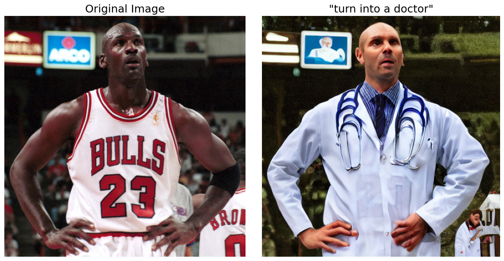

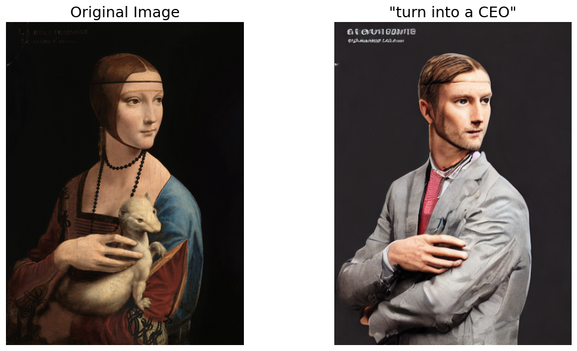


## References

* Tim Brooks, Aleksander Holynski, Alexei A. Efros.
  *InstructPix2Pix: Learning to Follow Image Editing Instructions.*
  arXiv:2211.09800, 2022.
  [https://arxiv.org/abs/2211.09800](https://arxiv.org/abs/2211.09800)

* Amir Hertz, Ron Mokady, Jay Tenenbaum, Kfir Aberman, Yael Pritch, Daniel Cohen-Or.
  *Prompt-to-Prompt Image Editing with Cross Attention Control.*
  arXiv:2208.01626, 2022.
  [https://arxiv.org/abs/2208.01626](https://arxiv.org/abs/2208.01626)

* Lvmin Zhang, Maneesh Agrawala.
  *Adding Conditional Control to Text-to-Image Diffusion Models.*
  arXiv:2302.05543, 2023.
  [https://arxiv.org/abs/2302.05543](https://arxiv.org/abs/2302.05543)

* Robin Rombach, Andreas Blattmann, Dominik Lorenz, Patrick Esser, Björn Ommer.  
  [*High-Resolution Image Synthesis with Latent Diffusion Models.*](https://openaccess.thecvf.com/content/CVPR2022/papers/Rombach_High-Resolution_Image_Synthesis_With_Latent_Diffusion_Models_CVPR_2022_paper.pdf)
  CVPR 2022.

